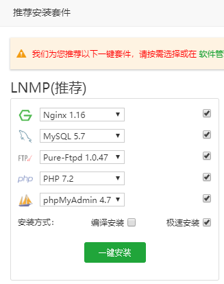
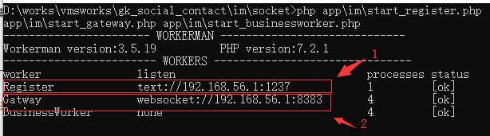
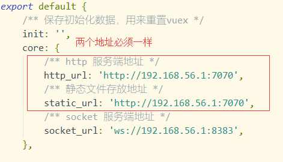
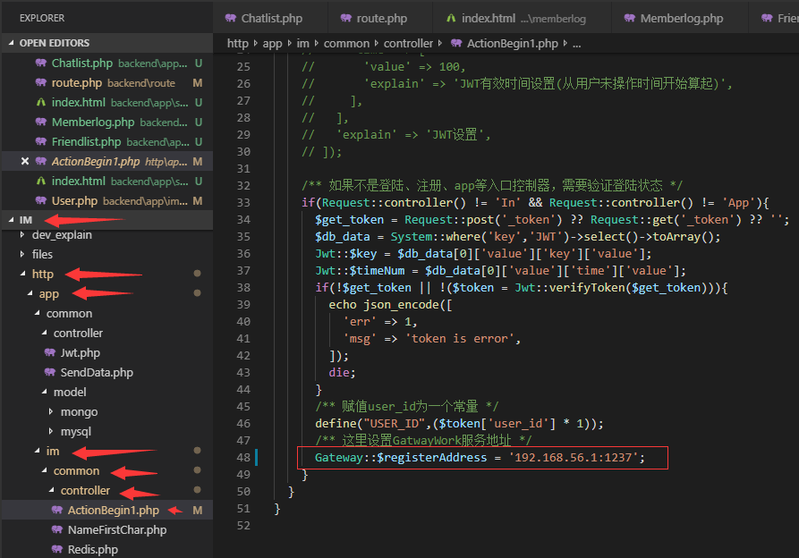
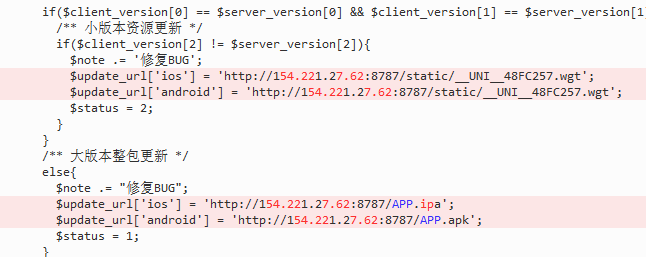

http://119.23.109.165:8989
# 社交系统

## 生产测试环境
<!--
```
Congratulations! Installed successfully!
==================================================================
Bt-Panel: http://154.221.27.62:8888/2e92513d/
username: ugkkb6i!a!
password: d9fd790d
Warning:
If you cannot access the panel, 
release the following port (8888|***|**|***|20|21) in the security group
 ============================================================
服务器 密码 GG123123erat!g!
```
-->

```
后台地址
shejiao123bb.767717.com

前台
app.703336.com  

https://gitee.com/jiangjiangfengfeng/im.git 
```


## 在本地搭建开发环境：


- 1、搭建前台uni-app(api地址在 /commonn/store/state 文件修改)（后续修改前台文件，添加功能，需要了解uni-app）
- 2、打开socket服务器运行文件 start_im_win.bat (socket目录)(暂时是用来做发送实时消息通道，没有逻辑，逻辑全部在http服务上)
>下图中ip: 192.168.56.1 是本地开发机ip

- 3、搭建好http服务（搭建http目录下public为一个网站）
- 4、安装mongo db,然后再安装php运行环境mongoDb扩展，

- 5、修改前台配置文件：im\view\common\store\state.js
>下图2标识的主机：端口必须与 第二步中图中标识的2一致



- 6、修改http服务，im\http\app\im\common\controller\ActionBegin1.php
>下图标识的主机：端口必须与 第二步中图中标识的1一致


- 7、修改：im\http\app\im\controller\App.php
服务器上下载打包路径

