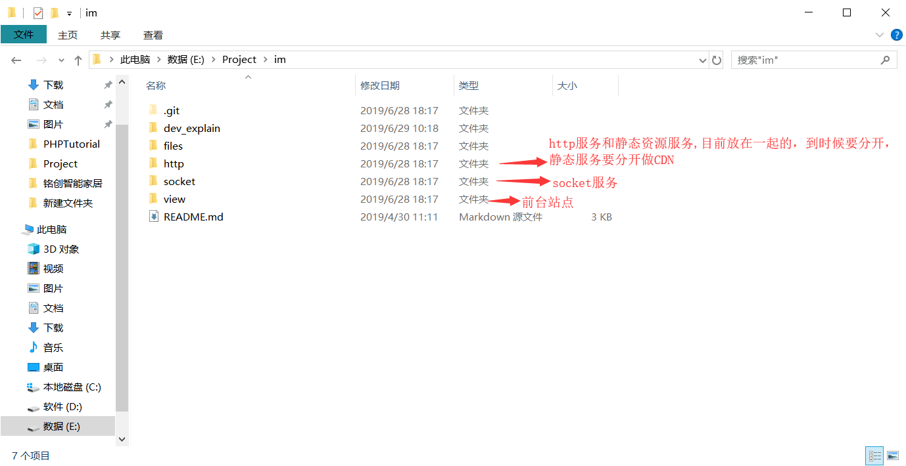
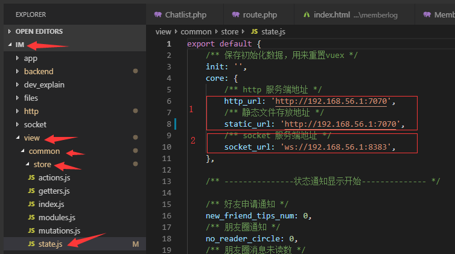

http://119.23.109.165:8989

# 在本地搭建开发环境：

- 1、搭建前台uni-app(api地址在 /commonn/store/state 文件修改)（后续修改前台文件，添加功能，需要了解uni-app）
- 2、打开socket服务器运行文件 start_im_win.bat (socket目录)(暂时是用来做发送实时消息通道，没有逻辑，逻辑全部在http服务上)
- 3、搭建好http服务（搭建http目录下public为一个网站）
- 4、安装mongo db,然后再安装php运行环境mongoDb扩展，

- 5、修改前台配置文件：im\view\common\store\state.js

